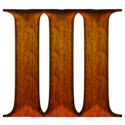

[![Stargazers][stars-shield]][stars-url]
[![Issues][issues-shield]][issues-url]
[![MIT License][license-shield]][license-url]

<!-- PROJECT LOGO -->
 

  

  <h3 align="center">Resource Manager</h3>

  

    Utility for viewing, creating and extracting files from Age of Empires III .BAR archive
     
     <a href="https://github.com/XaKOps/Resource-Manager">Download</a>
  

<!-- TABLE OF CONTENTS -->
## Table of Contents

* [About the Project](#about-the-project)
* [Usage](#usage)
* [License](#license)
* [Contact](#contact)
* [Acknowledgements](#acknowledgements)

<!-- ABOUT THE PROJECT -->
## About The Project

[![Product Name Screen Shot][product-screenshot]]()

<!-- USAGE EXAMPLES -->
## Usage

Use this space to show useful examples of how a project can be used. Additional screenshots, code examples and demos work well in this space. You may also link to more resources.

<!-- LICENSE -->
## License

Distributed under the MIT License. See `LICENSE` for more information.

<!-- CONTACT -->
## Contact

XaKOps - Discord: XaKOps#1244 - xakops@gmail.com

Project Link: [https://github.com/XaKOps/Resource-Manager](https://github.com/XaKOps/Resource-Manager)

<!-- ACKNOWLEDGEMENTS -->
## Acknowledgements
* [ProjectCeleste/ProjectCeleste.GameFiles.Tools](https://github.com/ProjectCeleste/ProjectCeleste.GameFiles.Tools)
* [PaulZero/AoE3-File-Readers](https://github.com/PaulZero/AoE3-File-Readers)
* [AoE3Ed by Ykkrosh](http://games.build-a.com/aoe3/files/)

<!-- MARKDOWN LINKS & IMAGES -->
<!-- https://www.markdownguide.org/basic-syntax/#reference-style-links -->

[stars-shield]: https://img.shields.io/github/stars/XaKOps/Resource-Manager.svg?style=flat-square
[stars-url]: https://github.com/XaKOps/Resource-Manager/stargazers
[issues-shield]: https://img.shields.io/github/issues/XaKOps/Resource-Manager.svg?style=flat-square
[issues-url]: https://github.com/XaKOps/Resource-Manager/issues
[license-shield]: https://img.shields.io/github/license/XaKOps/Resource-Manager.svg?style=flat-square
[license-url]: https://github.com/XaKOps/Resource-Manager/blob/master/LICENSE.txt
[product-screenshot]: Images/1.png

